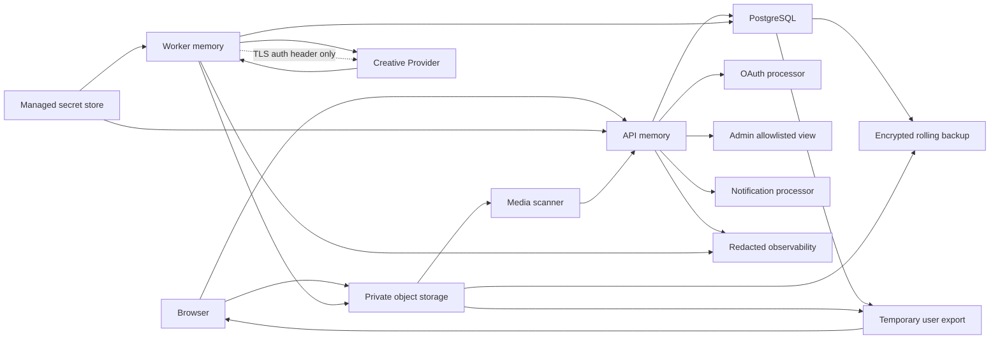

# V1 Data Governance Baseline

This is the human-readable decision record for V1-45. The machine-readable source of truth is
`config/v1-data-governance.json`, and `npm run test:v1-data-governance` prevents the inventory, retention, flow,
export, deletion, redaction, and external-processor contracts from drifting silently.

This engineering baseline was frozen on **2026-07-11**. It is not legal advice. V1-78 and an authorized legal review
must confirm notices, lawful bases, jurisdiction-specific rights, legal retention, and processor disclosures before
production.

## Decision Status

The data inventory and implementation contract are frozen. The complete runtime is not implemented.

- All 27 Prisma models are assigned exactly once to a governed data asset.
- Six non-Prisma asset classes cover raw generation inputs, raw Provider payloads, observability, backups, export
  packages, and deployment secrets.
- Unknown data is `restricted`; unknown flows and processors are denied.
- Production data in fixtures, mocks, demo seeds, Notion, or source control is forbidden.
- Raw Provider payload persistence and secret persistence outside a managed secret store are forbidden.
- Account export/deletion, Provider deletion receipts, backup expiry rehearsal, and global retention automation remain
  unimplemented.
- No real Provider call, credential, SDK, callback, polling client, deletion request, or production traffic is approved
  by this record.

## Classification

| Class | Meaning | Minimum controls |
| --- | --- | --- |
| `public` | Explicitly published content | Owner-controlled publication, policy check, invalidation, deletion propagation |
| `internal` | Low-risk operational metadata | Authenticated staff/service access, purpose allowlist, bounded retention |
| `confidential` | Account, marketplace, creative, or internal-ledger data | Encryption, ownership/RBAC, elevated-read audit, export/delete mapping |
| `restricted` | Credentials, private media, moderation, security, raw input, or sensitive personal data | Least privilege, allowlist/redaction, encryption, access audit, shortest practical retention |
| `secret` | Keys, signing secrets, authorization headers, live credentials | Managed secret store, runtime injection, no logs/exports, rotation and incident revocation |

The highest applicable classification wins. A public post can contain restricted report evidence; that evidence does
not become public because the post is public.

## Data Inventory

| Asset id | Class | Primary persistence | Prisma models or runtime form | Default retention |
| --- | --- | --- | --- | --- |
| `governance_configuration` | Internal | PostgreSQL | `Permission`, `RolePermission`, `SystemSetting` | Superseded history 365 days |
| `operation_leases` | Internal | PostgreSQL | `OperationLease` | Expiry/release + 7 days |
| `identity_account_profile` | Confidential | PostgreSQL | `User`, `Profile` | Verified deletion + 30 days |
| `authentication_credentials_sessions` | Restricted | PostgreSQL | `AuthAccount`, `RefreshToken` | Unlink/expiry/revoke + 30 days |
| `marketplace_records` | Confidential | PostgreSQL | `Task`, `TaskProposal`, `TaskSubmission` | Terminal task/dispute + 730 days |
| `community_content_interactions` | Public | PostgreSQL | `Post`, `Comment`, `PostLike` | Delete request + 30 days |
| `private_library_items` | Confidential | PostgreSQL | `LibraryItem` | Delete request + 30 days |
| `internal_points_ledger` | Confidential | PostgreSQL | `PointLedger` | Terminal entry/account close + 730 days |
| `media_asset_metadata` | Confidential | PostgreSQL | `MediaAsset` | Delete/reject/abandon + 30 days; V1-09 output metadata excludes Provider URLs |
| `media_object_bytes` | Restricted | Object storage | Uploads, attachments, generated assets | Revoke now, object delete within 24 hours |
| `media_scan_safety_records` | Restricted | PostgreSQL/archive | `MediaScanJob` | Terminal scan + 180 days, maximum 50/asset |
| `creative_generation_records` | Restricted | PostgreSQL | `CreativeGeneration` | Terminal generation + 365 days; preview 30 days |
| `provider_lifecycle_records` | Restricted | PostgreSQL | `CreativeProviderReplayLedger`, `CreativeGenerationMutation`, `CreativeOutputIngestion` | Terminal Provider lifecycle + 180 days |
| `creative_accounting_records` | Confidential | PostgreSQL | `CreativeCreditLedger`, `CreativeQuotaWindow`, `CreativeQuotaReservation` | Terminal/account close + 730 days |
| `notification_records` | Confidential | PostgreSQL | `Notification` | Created + 180 days |
| `moderation_review_records` | Restricted | PostgreSQL | `AdminReview` | Review/appeal close + 730 days |
| `audit_event_records` | Restricted | PostgreSQL/archive | `AuditEvent` | Created + 730 days |
| `security_event_records` | Restricted | PostgreSQL | `SecurityEvent` | 365 days; confirmed critical incident 730 days |
| `raw_generation_inputs` | Restricted | Browser/runtime memory | Prompt, message, attachment, reference, attestation | Zero durable retention unless separately normalized |
| `raw_provider_payloads` | Restricted | Runtime memory | Provider request/response/callback/poll | Zero durable retention after allowlisted normalization |
| `observability_logs_traces_metrics` | Internal | Telemetry store | Structured logs, traces, metrics | Logs 30 days, traces 7, aggregate metrics 90 |
| `backup_archive_copies` | Restricted | Backup/archive store | Encrypted database/object backup, archive manifest | Rolling maximum 35 days |
| `user_export_packages` | Restricted | Temporary export storage | Manifest, JSON, clean owned assets, checksums | Package 7 days, private link 24 hours |
| `deployment_secrets` | Secret | Managed secret store/runtime memory | Keys, credentials, signing material | Rotate every 90 days; retire/delete within 30 |

These are maximum engineering defaults, not a reason to keep unused data. Data may be deleted earlier when its purpose
ends and no validated exception applies.

## Deletion Semantics

Deletion uses the action appropriate to the record, not a single database cascade:

- Account/profile data: disable immediately, remove public profile visibility, delete private profile fields, and use a
  non-identifying tombstone where shared task/audit integrity requires a subject reference.
- Auth data: revoke live sessions and OAuth access immediately, then hard-delete credential material.
- Marketplace and internal ledger: delete private drafts/content; anonymize the subject while retaining bounded shared
  transaction and reconciliation evidence.
- Community and private library: delete user-owned content, or retain only anonymized thread structure when deleting a
  node would corrupt another user's conversation.
- Media: revoke download immediately, invalidate cache/CDN within 24 hours, delete the object within 24 hours, then
  remove metadata after review/hold checks.
- Generation: delete prompt preview and owned outputs, anonymize actor references, retain only bounded safe evidence,
  then prune the record at expiry.
- Audit/security/moderation: pseudonymize the subject and retain allowlisted decision/incident evidence only until its
  policy expires.
- Backups: do not mutate every immutable backup. Mark the subject deletion in restore procedures, expire backups within
  35 days, and reapply deletion before a restored environment can serve traffic.

Current foreign keys include both `Cascade` and `Restrict` behavior. V1-67 must implement the deletion plan explicitly;
database cascade alone is not proof of correct deletion or anonymization.

## Data Flow

Every arrow is deny-by-default and must have a purpose-specific parser, minimum payload, encryption, destination
retention, and deletion propagation. Important boundaries:

1. Browser uploads remain private and untrusted until scanning and review complete.
2. Creative Provider dispatch requires separate real-call approval, region eligibility, content policy, retention and
   training terms, and a budget gate.
3. Provider responses and callbacks remain in memory until normalized to safe ids, hashes, status, cost, and redacted previews; callback raw bodies are discarded after exact-body authentication and allowlisted projection.
4. Admin, notifications, logs, metrics, and exports each use their own allowlist; a safe database row is not
   automatically safe for every secondary surface.
5. Export packages are encrypted, single-subject, checksum-manifested, short-lived, and delivered through a private
   one-day link.
6. A Provider credential may leave runtime memory only as a TLS Authorization header for the approved Provider. It is
   never placed in a URL/body/log and the Provider must not retain it as application data.

## Forbidden Flows

- Secrets to PostgreSQL, logs, metrics, backups, exports, Admin, notifications, browsers, Notion, chat, or source code.
- Raw Provider requests/responses to any persistent store or secondary surface.
- Raw prompts/conversations to Admin, observability, notifications, or backups.
- Private signed URLs or expiring Provider URLs to audit, notifications, logs, or long-lived metadata.
- Email, handle, display name, IP address, raw prompt, or other high-cardinality identity in metrics labels.
- Production data in fixture, mock, demo-seed, local screenshot, or test-report artifacts.
- User/Provider data to an unknown processor, unsupported region, or unapproved cross-border path.
- Cross-user or public export links.

## Export Contract

V1-67 owns implementation. The baseline requires:

1. Recent authentication and step-up verification for sensitive exports.
2. A request id and immutable audit event.
3. Per-asset export policy evaluation and other-subject redaction.
4. JSON manifest, UTF-8 JSON records, eligible owned clean assets, and SHA-256 checksums.
5. A manifest of excluded classes and redaction reasons.
6. A 30-day fulfillment target, seven-day package retention, and 24-hour private download link.
7. Created, downloaded, expired, and deleted evidence.

Passwords/hashes, tokens, Provider credentials, raw Provider payloads, private operational notes, security detection
logic, other users' data, and backup containers are never exported. A safe user-facing status or decision summary may
replace excluded internal evidence.

## Account Deletion Contract

After recent authentication and explicit confirmation:

1. Immediately disable the account, revoke sessions/OAuth tokens and private downloads, and block new jobs and
   notifications.
2. Build a per-asset plan with delete, anonymize, retain-until-expiry, processor-delete, and exception outcomes.
3. Delete private objects and invalidate caches within 24 hours.
4. Submit applicable external-processor deletion requests within 24 hours and record receipts/confirmation within 30
   days.
5. Complete primary-store deletion/anonymization within 30 days.
6. Let rolling backups expire no later than 35 days after primary purge and reapply deletion after any restore.
7. Close only when per-store results, exceptions, processor receipts, and timestamps are recorded.

Deletion failure is visible and retryable; the system must never report completion merely because the user row changed
to `deleted`.

## Legal Holds

Legal holds are scoped exceptions, not a general retention switch. A hold requires an authorized role, hold id, scope,
reason code, authority reference, owner, creation/review/expiry timestamps, and a 90-day review. Indefinite holds are
forbidden. Unrelated data continues through normal deletion.

## External Processors

All eight selected creative Providers remain `not_approved` for real traffic. Their detailed terms are in
`config/v1-provider-matrix.json`.

| Provider | Data baseline | Default remote-retention concern | Production condition |
| --- | --- | --- | --- |
| OpenAI GPT Image 2 | Prompt/reference/output | Up to 30-day abuse monitoring | Supported geography and approved retention/ZDR posture |
| Replicate FLUX 1.1 Pro | Prompt/reference/output | API data normally removed after one hour | Geography, model terms, training, retention/deletion evidence |
| OpenAI GPT-5.6 Terra | Messages/context | Up to 30-day abuse monitoring; `store=false` | Supported geography and approved retention/ZDR posture |
| Anthropic Claude Sonnet 5 | Messages/context | 30-day standard with policy/legal/safety exceptions | Supported-country and US-storage approval |
| Google Veo 3.1 Fast | Prompt/reference/output | Abuse logging and up to 24-hour cache may apply | Approved US region and logging/cache configuration |
| Runway Gen-4.5 | Prompt/reference/output | Upload/output URL expiry does not define all retention | Enterprise no-training, retention, deletion, and region terms |
| ElevenLabs Music v2 Enterprise | Prompt/lyrics/reference/output | Public Music deletion period is not established | Enterprise Music order, region/ZRM, opt-out, deletion receipt |
| Google Lyria 3 Pro Preview | Prompt/reference/output | Preview retention requires written confirmation | Preview/cross-border approval and model-specific evidence |

OAuth, object storage/CDN, media scanner, and notification delivery are separate processor classes with minimum scopes,
private storage, retention, deletion, signed requests, and incident-contact requirements owned by V1-48, V1-50, V1-51,
and V1-53.

## Redaction And Secondary Use

Safe previews remain bounded to 160 prompt characters and 240 error characters after secret, URL, and personal-data
redaction. Unknown or unsafe identifiers are folded to stable hashes.

Forbidden keys include authorization, cookies, passwords/hashes, tokens/hashes, secrets, private/API keys, raw prompts
or conversations, raw Provider requests/responses, and private download URLs.

Observability allows only request id, route template, method, status family, duration bucket, low-cardinality error/job
codes, folded Provider/workspace ids, and aggregate counts. Admin, notification, and export serializers use separate
purpose-specific allowlists and must not reuse raw repository objects.

## Current Runtime Baseline

Available foundations:

- `User.status` has a `deleted` value.
- Refresh sessions can be revoked and have expiry timestamps.
- Media scan history supports archive-before-prune with 180-day and 50-record defaults.
- Creative records store prompt hash and bounded preview, not a raw prompt column.
- Provider adapter metadata rejects secret-like keys.
- The default-disabled Provider HTTP client reads its credential only from deployment secrets, fixes the destination and
  model endpoint, and sends only an allowlisted minimum payload.
- The default-disabled staging callback API verifies exact-body HMAC, timestamp and nonce/job binding, rejects unknown
  payload fields, stores only normalized evidence, and claims replay side effects atomically.
- Admin creative serializers fold unsafe identifiers, URLs, and errors.
- Mock/S3-compatible object and archive writer boundaries exist.
- Versioned policy consent is stored as an allowlisted immutable `AuditEvent` without IP, token, user-agent, or raw-content fields.
- Support/report/appeal/privacy/export/deletion entry requests use owner-scoped `AdminReview` rows; audit metadata excludes free-form details.

Known gaps:

- No account export package builder or account deletion orchestrator.
- No field-level retention sweeper outside media scan history.
- No Provider deletion request/receipt ledger.
- No backup expiry/restore deletion rehearsal evidence.
- No global structured-log allowlist enforcement.
- No legal-hold registry and expiry workflow.
- Current foreign keys do not implement the frozen anonymization plan by themselves.

## Implementation Handoff

| Task | Data-governance ownership |
| --- | --- |
| V1-05 | Implemented default-disabled Provider secret and minimum-payload HTTP boundary; external calls remain approval-gated |
| V1-06 | Implemented default-disabled callback authentication, zero-retention payload projection, replay claim, and safe audit boundary; real webhook delivery remains approval-gated |
| V1-07 | Implemented default-disabled status polling projection, safe retry/timeout recovery, worker isolation, and audit boundary; real status reads remain approval-gated |
| V1-08 | Implemented idempotent cancel/retry/manual replay with dedicated permissions, child attempts, two-person review, and raw-prompt exclusion |
| V1-09 | Implemented source-keyed output ingestion, injected-fetch SSRF/size/MIME/checksum boundaries, deterministic storage, scanner gating, and zero-retention Provider URLs; real output fetch remains approval-gated |
| V1-48 | OAuth scopes, identifiers, unlink, region, and sessions |
| V1-49 | PostgreSQL backup, expiry, restore, and deletion rehearsal |
| V1-50 | Private object storage/CDN and lifecycle deletion |
| V1-51 | Scanner minimization, isolation, retention, and deletion |
| V1-53 | Observability and notification processor retention/redaction |
| V1-54 | Managed secrets, runtime injection, rotation, and revocation |
| V1-59 to V1-63 | Modality safety evidence, review, appeal, and holds |
| V1-67 | Account export/deletion/anonymization orchestration |
| V1-69 | Admin least privilege and elevated-read audit |
| V1-73 | Privacy, secret, supply-chain, and deletion release review |
| V1-78 | Privacy notice, AUP, rights, processors, and support entry points |

## Change Control

Any classification, purpose, asset, retention, flow, processor, export/delete target, redaction rule, or handoff change
must update the JSON and this document together, pass `npm run test:v1-data-governance`, and record the policy-version
impact in Notion. A looser retention, broader processor flow, or new secondary use requires product, privacy/legal,
security, and data-owner approval before runtime enablement.
