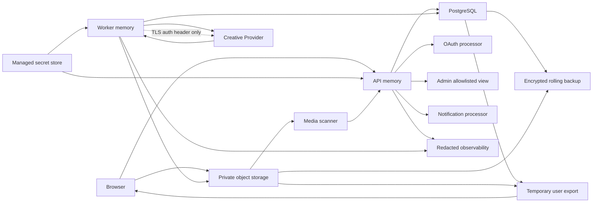

# V1 Data Governance Baseline

This is the human-readable decision record for V1-45. The machine-readable source of truth is
`config/v1-data-governance.json`, and `npm run test:v1-data-governance` prevents the inventory, retention, flow,
export, deletion, redaction, and external-processor contracts from drifting silently.

This engineering baseline was frozen on **2026-07-13**. It is not legal advice. V1-78 and an authorized legal review
must confirm notices, lawful bases, jurisdiction-specific rights, legal retention, and processor disclosures before
production.

## Decision Status

The data inventory and implementation contract are frozen. The complete runtime is not implemented.

- All 171 Prisma models are assigned exactly once to a governed data asset.
- Six non-Prisma asset classes cover raw generation inputs, raw Provider payloads, observability, backups, export
  packages, and deployment secrets.
- Unknown data is `restricted`; unknown flows and processors are denied.
- Production data in fixtures, mocks, demo seeds, Notion, or source control is forbidden.
- Raw Provider payload persistence and secret persistence outside a managed secret store are forbidden.
- Account export/deletion and due-deletion processing are implemented. External Provider deletion runs before local deletion through an explicitly enabled HTTPS privacy gateway and stores only bounded hash-based receipts.
- Production object-storage export acceptance, target-environment 35-day backup scheduling and managed-key destruction, field-level retention automation, processor disclosure, and legal approval remain incomplete. The isolated RELEASE-01 runner now deletes database/media backup objects after recovery and proves restore-negative HEAD/GET behavior, but that simulated boundary is not production acceptance. `config/v1-data-governance.json` carries a one-to-one `retentionAutomationInventory` for all 24 policies; it is the authoritative implemented/partial/pending/blocked inventory and does not change `retentionAutomationComplete=false`.
- OAuth authorization requests, refresh tokens, and API key credentials now have a default-disabled leased retention worker that hard-deletes terminated credentials after 30 days. Migration `0106`, focused tests, and isolated PostgreSQL acceptance passed; target-environment acceptance is still required and production approval remains false.
- Audit events now have a default-disabled leased archive-before-prune worker. It preserves the configured recent-event floor, rejects Mock or failed archive storage, and revalidates the bounded 730-day prefix under the audit-chain transaction lock before writing immutable disposition evidence and pruning. Target-environment S3 execution and retained-prefix verification are still required; global retention and production approval remain false.
- Moderation now has two default-disabled leased 730-day redaction workers. The case worker starts after the 30-day appeal window when no appeal exists, or after the appeal decision; pending appeals, scoped `audit/safety` legal holds, and concurrent holds block processing. The operational worker treats the final `retired` transition as a rule version's terminal time and creation as a completed bulk operation's terminal time. Migrations `0110` and `0111` remove case, rule, transition, and bulk-operation subject links and free-text/target details while retaining bounded categories, hashes, counts, reason codes, outcomes, states, and timestamps. Retention-redacted rules are permanently retired, and bulk replay remains deduplicated by a non-reversible idempotency hash. Target-environment acceptance is pending and production approval remains false.
- Marketplace retention now has a default-disabled leased worker for mutable task-family records. Migration `0113` hard-deletes untouched 30-day drafts and minimizes terminal task, proposal, submission, dispute-review, notification, search, and portfolio-source copies after 730 days. Active submissions, open disputes, unsettled escrow/accounting, and scoped `tasks` legal holds fail closed. All task-family writes share `task:<id>` database locks, and a redacted task cannot be re-identified. This remains partial: `TaskLifecycleMutation`, `DomainEventOutbox`, `PointLedger`/internal accounting, and normalized `TaskSubmissionAsset` links are governed as append-only or immutable evidence and cannot be rewritten or deleted without an approved anonymized-evidence contract. Isolated PostgreSQL acceptance passed; target-environment migration and worker acceptance remain pending, so global retention and production approval remain false.
- Rotated Provider inference credentials now have a default-disabled leased lifecycle worker. It sends only transient SecretRef/version metadata to an explicitly confirmed fixed HTTPS Secret Manager gateway, records hash-only immutable receipts, disables a retired version first, and deletes it only after the replacement has been current for 30 days. Stable idempotency keys make retries safe. Encryption, decryption, and signing purposes are excluded by a closed purpose allowlist. Migration `0114` and target-environment gateway acceptance remain required; global retention and production approval remain false.
- New internal-accounting facts no longer copy a user id or public handle into immutable movement `accountRef`, operation `actorRef`, reconciliation issue keys, missing-account source ids, or reconciliation evidence. Prisma and Seed use the same stable `subject_<sha256>` reference while transient owner ids remain available only to the balance-update transaction. Real PostgreSQL concurrency, reconciliation, dual-reviewed repair, and pseudonymization checks pass. This is partial: historical immutable operations, movements, issues, reviews, and compensation evidence still require an approved anonymized-evidence or cryptographic-erasure contract before a retention worker can process them.
- Closed support records now use a default-disabled leased two-stage minimization worker. Message bodies are replaced after 365 days; after 730 days requester, assignee, author, creator, subject-reference, free-text, locale context, and related-resource links are removed while bounded ticket state, SLA timestamps, and typed immutable case identifiers remain. Active `support/audit` legal holds and non-terminal data-rights requests block processing. Migration `0115` and target-environment concurrency/access acceptance remain required; global retention and production approval remain false.
- Terminal Provider lifecycle records now use a default-disabled leased 180-day minimization worker. Replay is correctly governed as a state transition rather than append-only because claim and applied/rejected side-effect results update the row. Migration `0116` adds irreversible retention markers and shared `creative-generation:<id>` write locks across operation, mutation, replay, output-ingestion, and retry records. Provider job/event identifiers, original idempotency/source keys, requester and asset/storage/claim references, previews, and free JSON are removed only after every lifecycle record is terminal and review, legal-hold, accounting, quota, and reconciliation blockers are closed; bounded status, reason, timing, count, and SHA-256 evidence remains. Isolated PostgreSQL acceptance passed, but target-environment migration, scheduling, replay, alerting, and access-control acceptance remain required; global retention and production approval remain false.
- Superseded system-setting and configuration-resource history now has a default-disabled leased 365-day minimization worker. It preserves revision IDs, versions, event types, content hashes, predecessor links, reason codes, and a database-validated bounded SHA-256 shape summary while irreversibly clearing full values, titles/descriptions, actor references, change diffs, and notes. Current revisions and pending/approved rollback targets are excluded. Publication and retention share scope advisory locks, migration `0117` prevents malformed summaries and restoration after minimization, and isolated PostgreSQL 18 migration/concurrency/negative acceptance passed. Target-environment migration, scheduling, alerting, and access-control acceptance remain required; global retention and production approval remain false.
- Media metadata now has a default-disabled leased retention worker. After the object is confirmed deleted, deleted/rejected assets reach 30 days or abandoned pending uploads reach one day, and no active `media/audit/safety` hold exists, migration `0118` deletes mutable Private Library copies, retains immutable task/generation/Chat/lineage evidence and portfolio/scan state rows while clearing owner and free-form context, removes the asset from legacy parent arrays, clears asset owner, subject, file, object, verification, and metadata fields, and retains an irreversible structural tombstone. All media/reference writes share `media-asset:<id>` transaction locks and database triggers reject restoration or reattachment. A fresh PostgreSQL 18 database applied all 112 migrations, and strict hold, object-first, concurrency, relation-minimization, legacy-array cleanup, and negative acceptance passed; target-environment scheduling and storage evidence remain required.
- No real Provider call, credential, SDK, callback, polling client, deletion request, or production traffic is approved
  by this record.

## Classification

| Class | Meaning | Minimum controls |
| --- | --- | --- |
| `public` | Explicitly published content | Owner-controlled publication, policy check, invalidation, deletion propagation |
| `internal` | Low-risk operational metadata | Authenticated staff/service access, purpose allowlist, bounded retention |
| `confidential` | Account, marketplace, creative, or internal-ledger data | Encryption, ownership/RBAC, elevated-read audit, export/delete mapping |
| `restricted` | Credentials, private media, moderation, security, raw input, or sensitive personal data | Least privilege, allowlist/redaction, encryption, access audit, shortest practical retention |
| `secret` | Keys, signing secrets, authorization headers, live credentials | Managed secret store, runtime injection, no logs/exports, rotation and incident revocation |

The highest applicable classification wins. A public post can contain restricted report evidence; that evidence does
not become public because the post is public.

## Data Inventory

| Asset id | Class | Primary persistence | Prisma models or runtime form | Default retention |
| --- | --- | --- | --- | --- |
| `governance_configuration` | Internal | PostgreSQL | `Permission`, `RolePermission`, `SystemSetting`, `SystemSettingChange`, `SystemSettingRevision`, `WebhookControl` | Superseded history 365 days |
| `operation_leases` | Internal | PostgreSQL | `OperationLease` | Expiry/release + 7 days |
| `identity_account_profile` | Confidential | PostgreSQL | `User`, `Profile`, `ProfilePortfolioAsset` | Verified deletion + 30 days |
| `authentication_credentials_sessions` | Restricted | PostgreSQL | `AuthAccount`, `OAuthAuthorizationRequest`, `RefreshToken` | OAuth request expiry; unlink/expiry/revoke + 30 days |
| `account_generation_risk_records` | Restricted | PostgreSQL | `RiskPolicy`, `RiskSignal`, `RiskCase`, `RiskCaseSignal`, `RiskDispositionEvent`, `RiskAppeal` | Terminal case + 365 days; subject, appeal, actor, and dedupe links are redacted while hash-only decision evidence is preserved; active `audit/safety` hold blocks redaction |
| `developer_credentials` | Restricted | PostgreSQL | `DeveloperAccessControl`, `ServiceAccount`, `ApiKeyCredential`, `WebhookSubscription`, `WebhookSigningSecret` | Revoke immediately; credential expiry plus 30 days; plaintext API and webhook signing keys have zero durable retention |
| `marketplace_records` | Confidential | PostgreSQL | `Task`, `TaskProposal`, `TaskSubmission` | Terminal task/dispute + 730 days |
| `community_content_interactions` | Public | PostgreSQL | `Post`, `Comment`, `PostLike` | Delete request + 30 days |
| `search_index_records` | Restricted | PostgreSQL | `SearchDocument`, `SearchDocumentGrant`, `SearchSyncQueue` | Searchable projection refresh/delete within 1 day; failed queue evidence within 7 days |
| `private_library_items` | Confidential | PostgreSQL | `LibraryItem` | Delete request + 30 days |
| `internal_points_ledger` | Confidential | PostgreSQL | `PointLedger`, `InternalPointAccount` | Terminal entry/account close + 730 days |
| `media_asset_metadata` | Confidential | PostgreSQL | `MediaAsset`, `MediaStorageObject`, `MediaAssetRelation` | Delete/reject + 30 days, abandoned pending upload + 1 day; object-first irreversible structural tombstone implemented, pending target-environment acceptance |
| `media_object_bytes` | Restricted | Object storage | Uploads, attachments, generated assets | Revoke now, object delete within 24 hours |
| `media_scan_safety_records` | Restricted | PostgreSQL/archive | `MediaScanJob` | Terminal scan + 180 days, maximum 50/asset |
| `creative_generation_records` | Restricted | PostgreSQL | `CreativeGeneration` | Terminal generation + 365 days; preview 30 days |
| `chat_conversation_messages` | Restricted | PostgreSQL/encrypted backup | `ChatConversation`, `ChatTurn`, `ChatMessage`, `ChatDeletionTombstone` | Inactive + 365 days; owner deletion is immediate with 35-day restore-replay evidence |
| `provider_lifecycle_records` | Restricted | PostgreSQL | `CreativeProviderReplayLedger`, `CreativeGenerationMutation`, `CreativeOutputIngestion`, `CreativeProviderRetryState`, `CreativeProviderOperation` | Terminal Provider lifecycle + 180 days; operation and failure evidence is allowlisted/hash-only |
| `creative_accounting_records` | Confidential | PostgreSQL | `CreativeCreditLedger`, `CreativeQuotaWindow`, `CreativeQuotaReservation` | Terminal/account close + 730 days |
| `internal_accounting_invariant_records` | Confidential | PostgreSQL | `InternalAccountingOperation`, `InternalAccountingMovement`, `AccountingReconciliationIssue` | Terminal/account close + 730 days; open reconciliation and dispute are retention exceptions |
| `provider_cost_budget_records` | Confidential | PostgreSQL | `CreativeProviderBudgetWindow`, `CreativeProviderCostLedger` | Provider cost close/reconciliation + 730 days; amounts stored as integer micros |
| `provider_control_records` | Confidential | PostgreSQL | `CreativeProviderControlState`, `CreativeProviderCapEvidence`, `CreativeProviderCircuitState`, `CreativeProviderCircuitEvent` | Control/circuit reconciliation + 730 days; evidence and probe tokens are hash-only |
| `ai_evaluation_records` | Restricted | PostgreSQL/archive | `AiEvaluationSuite`, `AiEvaluationCase`, `AiEvaluationPolicy`, `AiEvaluationRun`, `AiEvaluationCaseResult` | Created + 730 days; raw prompts/outputs are forbidden and only hashes, bounded scores, safety outcomes, and regression evidence persist |
| `provider_legal_review_records` | Restricted | PostgreSQL/archive | `ProviderLegalReview` | Created + 730 days; append-only Provider/model/environment/region decisions retain only gate outcomes, SHA-256 evidence and safe internal reviewer references, never contract bodies, URLs, credentials, Provider payloads or personal legal notes |
| `notification_records` | Confidential | PostgreSQL | `Notification`, `NotificationDelivery`, `WebhookDelivery`, `WebhookDeliveryAttempt`, `WebhookDeliveryReplay`, `ProviderAlertDelivery`, `ProviderAlertDeliveryAttempt`, `ProviderAlertDeliveryReplay` | Notifications: created + 180 days. Provider alerts: terminal update + 180 days; active delivery is excluded. Exports and Admin APIs omit outbound payloads, destinations, recipients and signing material |
| `support_ticket_records` | Restricted | PostgreSQL | `SupportTicket`, `SupportTicketMessage`, `SupportTicketCaseLink` | Closed + 365 days removes message bodies; closed + 730 days removes subject/free text/resource and actor links while retaining bounded ticket and immutable typed case evidence; legal holds and open data-rights requests block |
| `moderation_review_records` | Restricted | PostgreSQL | `AdminReview` | Review/appeal close + 730 days |
| `audit_event_records` | Restricted | PostgreSQL/archive | `AuditEvent`, `AuditArchiveManifest`, `AuditRetentionDisposition` | Created + 730 days; archive-before-prune, legal hold, retained-prefix checkpoints, and immutable disposition evidence are mandatory |
| `security_event_records` | Restricted | PostgreSQL | `SecurityEvent`, `SecurityIncident` | 365 days; resolved confirmed-critical incident 730 days; open incidents and matching audit/safety legal holds block deletion; unattributed legacy events fail closed while such a hold exists |
| `raw_generation_inputs` | Restricted | Browser/runtime memory | Prompt, message, attachment, reference, attestation | Zero durable retention unless separately normalized |
| `raw_provider_payloads` | Restricted | Runtime memory | Provider request/response/callback/poll | Zero durable retention after allowlisted normalization |
| `observability_logs_traces_metrics` | Internal | PostgreSQL telemetry store | Sanitized structured logs, Trace spans, anonymous daily retention aggregates, and versioned SLO alerts | Logs 30 days, traces 7 days, anonymous aggregates 90 days, alerts by incident policy |
| `backup_archive_copies` | Restricted | Backup/archive store | Encrypted database/object backup, archive manifest | Rolling maximum 35 days |
| `user_export_packages` | Restricted | Temporary export storage | Manifest, JSON, clean owned assets, checksums | Package 7 days, private link 24 hours |
| `deployment_secrets` | Secret | Managed secret store/runtime memory | Keys, credentials, signing material | Rotate every 90 days; retire/delete within 30 |

These are maximum engineering defaults, not a reason to keep unused data. Data may be deleted earlier when its purpose
ends and no validated exception applies.

Normalized portfolio lifecycle records are confidential while draft, withdrawn, or archived. Public profile projection exposes only allowlisted fields for explicitly published records whose source `MediaAsset` is still clean, uploaded, and active. V1-37 owns this delivery projection; V1-67 retains export and deletion ownership.

## Deletion Semantics

Deletion uses the action appropriate to the record, not a single database cascade:

- Account/profile data: disable immediately, remove public profile visibility, delete private profile fields, and use a
  non-identifying tombstone where shared task/audit integrity requires a subject reference.
- Auth data: revoke live sessions and OAuth access immediately, then hard-delete credential material.
- Marketplace and internal ledger: delete private drafts/content; anonymize the subject while retaining bounded shared
  transaction and reconciliation evidence.
- Internal accounting invariant records: never rewrite historical operations or movements; anonymize subject references
  at deletion and retain bounded operation, movement, issue, review, and append-only compensation evidence.
- Community and private library: delete user-owned content, or retain only anonymized thread structure when deleting a
  node would corrupt another user's conversation.
- Media: revoke download immediately, invalidate cache/CDN within 24 hours, delete the object within 24 hours, then
  remove metadata after review/hold checks.
- Generation: delete prompt preview and owned outputs, anonymize actor references, retain only bounded safe evidence,
  then prune the record at expiry.
- Chat: keep encrypted, owner-scoped application messages for at most 365 days after inactivity; revoke access
  immediately after an accepted deletion request, delete primary rows within 30 days, and replay that deletion after
  restore until rolling backups expire within 35 days.
- Audit/security/moderation: pseudonymize the subject and retain allowlisted decision/incident evidence only until its
  policy expires.
- Backups: do not mutate every immutable backup. Mark the subject deletion in restore procedures, expire backups within
  35 days, and reapply deletion before a restored environment can serve traffic.

Current foreign keys include both `Cascade` and `Restrict` behavior. V1-67 must implement the deletion plan explicitly;
database cascade alone is not proof of correct deletion or anonymization.

## Data Flow

```mermaid
flowchart LR
  Browser["Browser"] --> API["API memory"]
  Browser --> Storage["Private object storage"]
  Secrets["Managed secret store"] --> API
  Secrets --> Worker["Worker memory"]
  API --> DB["PostgreSQL"]
  API --> OAuth["OAuth processor"]
  Storage --> Scanner["Media scanner"]
  Scanner --> API
  Worker --> Provider["Creative Provider"]
  Provider --> Worker
  Worker -. "TLS auth header only" .-> Provider
  Worker --> Storage
  Worker --> DB
  API --> Admin["Admin allowlisted view"]
  API --> Notify["Notification processor"]
  API --> Observe["Redacted observability"]
  Worker --> Observe
  DB --> Backup["Encrypted rolling backup"]
  Storage --> Backup
  DB --> Export["Temporary user export"]
  Storage --> Export
  Export --> Browser
```

Every arrow is deny-by-default and must have a purpose-specific parser, minimum payload, encryption, destination
retention, and deletion propagation. Important boundaries:

1. Browser uploads remain private and untrusted until scanning and review complete.
2. Creative Provider dispatch requires separate real-call approval, region eligibility, content policy, retention and
   training terms, and a budget gate.
3. Provider responses and callbacks remain in memory until normalized to safe ids, hashes, status, cost, and redacted previews; callback raw bodies are discarded after exact-body authentication and allowlisted projection.
4. Admin, notifications, logs, metrics, and exports each use their own allowlist; a safe database row is not
   automatically safe for every secondary surface.
5. Export packages are encrypted, single-subject, checksum-manifested, short-lived, and delivered through a private
   one-day link.
6. A Provider credential may leave runtime memory only as a TLS Authorization header for the approved Provider. It is
   never placed in a URL/body/log and the Provider must not retain it as application data.
7. A transient Chat turn remains `raw_generation_inputs` in memory. Only validated application-owned conversation and
   message fields may be normalized into `chat_conversation_messages`; Provider state and raw Provider payloads never
   enter that asset.

## Forbidden Flows

- Secrets to PostgreSQL, logs, metrics, backups, exports, Admin, notifications, browsers, Notion, chat, or source code.
- Raw Provider requests/responses to any persistent store or secondary surface.
- Raw prompts/conversations to Admin, observability, notifications, or backups.
- Private signed URLs or expiring Provider URLs to audit, notifications, logs, or long-lived metadata.
- Email, handle, display name, IP address, raw prompt, or other high-cardinality identity in metrics labels.
- Production data in fixture, mock, demo-seed, local screenshot, or test-report artifacts.
- User/Provider data to an unknown processor, unsupported region, or unapproved cross-border path.
- Cross-user or public export links.

## Export Contract

V1-67 owns implementation. The baseline requires:

1. Recent authentication and step-up verification for sensitive exports.
2. A request id and immutable audit event.
3. Per-asset export policy evaluation and other-subject redaction.
4. JSON manifest, UTF-8 JSON records, eligible owned clean assets, and SHA-256 checksums.
5. A manifest of excluded classes and redaction reasons.
6. A 30-day fulfillment target, seven-day package retention, and 24-hour private download link.
7. Created, downloaded, expired, and deleted evidence.

The runtime now sweeps expired export packages with a dedicated, default-disabled leased worker. It accepts only the
`exports/data-rights/<safe-subject-ref>/<request-id>.json` namespace, treats storage `404` as idempotent success, deletes
the object before its database locator, and preserves only an immutable hash receipt in the request event and audit
trail. A failed object deletion keeps the locator for the next bounded retry.

Subject-owned Chat conversations and messages are included in the export with ordering and timestamps. Other-subject
content and internal safety evidence are redacted according to the per-asset policy.

Passwords/hashes, tokens, Provider credentials, raw Provider payloads, private operational notes, security detection
logic, other users' data, and backup containers are never exported. A safe user-facing status or decision summary may
replace excluded internal evidence.

## Account Deletion Contract

After recent authentication and explicit confirmation:

1. Immediately disable the account, revoke sessions/OAuth tokens and private downloads, and block new jobs and
   notifications.
2. Build a per-asset plan with delete, anonymize, retain-until-expiry, processor-delete, and exception outcomes.
3. Delete private objects and invalidate caches within 24 hours.
4. Submit applicable external-processor deletion requests within 24 hours and record receipts/confirmation within 30
   days.
5. Complete primary-store deletion/anonymization within 30 days.
6. Let rolling backups expire no later than 35 days after primary purge and reapply deletion after any restore.
7. Close only when per-store results, exceptions, processor receipts, and timestamps are recorded.

Deletion failure is visible and retryable; the system must never report completion merely because the user row changed
to `deleted`.

For Chat, accepting deletion immediately removes owner access, queues conversation/message hard deletion within the
same 30-day primary-store target, and writes restore-replay evidence so an older backup cannot resurrect access.

## Legal Holds

Legal holds are scoped exceptions, not a general retention switch. A hold requires an authorized role, hold id, scope,
reason code, authority reference, owner, creation/review/expiry timestamps, and a 90-day review. Indefinite holds are
forbidden. Unrelated data continues through normal deletion.

## External Processors

All eight selected creative Providers remain `not_approved` for real traffic. Their detailed terms are in
`config/v1-provider-matrix.json`.

| Provider | Data baseline | Default remote-retention concern | Production condition |
| --- | --- | --- | --- |
| OpenAI GPT Image 2 | Prompt/reference/output | Up to 30-day abuse monitoring | Supported geography and approved retention/ZDR posture |
| Replicate FLUX 1.1 Pro | Prompt/reference/output | API data normally removed after one hour | Geography, model terms, training, retention/deletion evidence |
| OpenAI GPT-5.6 Terra | Messages/context | Up to 30-day abuse monitoring; `store=false` | Supported geography and approved retention/ZDR posture |
| Anthropic Claude Sonnet 5 | Messages/context | 30-day standard with policy/legal/safety exceptions | Supported-country and US-storage approval |
| HCAI Router Seedance 2.0 Fast | Prompt/reference/output | Retention, logging, training, and deletion are not confirmed | Block sensitive data and production until Router/upstream terms and processing locations are approved |
| Runway Gen-4.5 | Prompt/reference/output | Upload/output URL expiry does not define all retention | Enterprise no-training, retention, deletion, and region terms |
| ElevenLabs Music v2 Enterprise | Prompt/lyrics/reference/output | Public Music deletion period is not established | Enterprise Music order, region/ZRM, opt-out, deletion receipt |
| Google Lyria 3 Pro Preview | Prompt/reference/output | Preview retention requires written confirmation | Preview/cross-border approval and model-specific evidence |

OAuth, object storage/CDN, media scanner, and notification delivery are separate processor classes with minimum scopes,
private storage, retention, deletion, signed requests, and incident-contact requirements owned by V1-48, V1-50, V1-51,
and V1-53.

## Redaction And Secondary Use

Safe previews remain bounded to 160 prompt characters and 240 error characters after secret, URL, and personal-data
redaction. Unknown or unsafe identifiers are folded to stable hashes.

Forbidden keys include authorization, cookies, passwords/hashes, tokens/hashes, secrets, private/API keys, raw prompts
or conversations, raw Provider requests/responses, and private download URLs.

Observability allows only request id, route template, method, status family, duration bucket, low-cardinality error/job
codes, folded Provider/workspace ids, and aggregate counts. Admin, notification, and export serializers use separate
purpose-specific allowlists and must not reuse raw repository objects.

## Current Runtime Baseline

Available foundations:

- `User.status` has a `deleted` value.
- Refresh sessions can be revoked and have expiry timestamps.
- Media scan history supports archive-before-prune with 180-day and 50-record defaults.
- Creative records store prompt hash and bounded preview, not a raw prompt column.
- Terminal creative generations now use a default-disabled two-stage retention Worker: prompt/error previews are cleared after 30 days, and subject, asset-reference, Provider-request and non-allowlisted JSON metadata is removed after 365 days. Active review/appeal, legal hold, Provider lifecycle, ingestion, mutation, quota, credit, cost, or reconciliation work blocks disposition; a database advisory-lock trigger serializes every generation write with retention.
- Provider adapter metadata rejects secret-like keys.
- The default-disabled Provider HTTP client reads its credential only from deployment secrets, fixes the destination and
  model endpoint, and sends only an allowlisted minimum payload.
- The default-disabled staging callback API verifies exact-body HMAC, timestamp and nonce/job binding, rejects unknown
  payload fields, stores only normalized evidence, and claims replay side effects atomically.
- Admin creative serializers fold unsafe identifiers, URLs, and errors.
- Mock/S3-compatible object and archive writer boundaries exist.
- Versioned policy consent is stored as an allowlisted immutable `AuditEvent` without IP, token, user-agent, or raw-content fields.
- Prisma and Seed observability writes now share a fail-closed persistent-log projector. Root fields match `ObservabilityLog`; event attributes are flat and limited to HTTP status/sampling or bounded frontend identifiers and SHA-256 error evidence. Unknown keys and nested objects are rejected before a log or paired span is written.
- Support/report/appeal/privacy/export/deletion entry requests use owner-scoped `AdminReview` rows; audit metadata excludes free-form details.
- The V1-20 Chat contract names the governed conversation asset, 365-day inactivity limit, immediate access revocation,
  30-day primary deletion target, and 35-day backup-expiry boundary.
- V1-21 encrypts message bodies with versioned AES-256-GCM keys, owner-scopes history, persists explicit stream terminal
  states, sweeps expired conversations, and reapplies deletion tombstones after restore.
- V1-22 persists only selected attachment ids, selected product-context references, and identity-free safety evidence.
  Context bodies remain in request memory and review metadata excludes raw content.
- V1-24 adds a default-disabled staging reader and Provider client. Attachment bytes, resolved context bodies, and raw
  Provider payloads remain request-memory-only and are excluded from Chat rows, generation records, reviews, and audits.

Known gaps:

- Account export expiry automation is implemented; production object-store deletion and failure-retry acceptance is still required.
- Field-level retention remains incomplete globally. Generation terminal metadata now joins the bounded sweepers already implemented for media scan, Chat, data-rights export packages, observability, notifications, operation leases, private Library, auth credentials, audit events, community, security, risk, and moderation records. Target-environment migration acceptance and the remaining frozen policy conflicts are still required.
- Provider deletion gateway still needs production processor disclosure, legal approval, and production-like acceptance.
- Local isolated backup expiry now verifies database/media backup deletion and restore-negative GET behavior after a simulated 35-day boundary. Target-environment lifecycle scheduling and managed-key destruction evidence remain incomplete.
- Scoped legal-hold registry and expiry behavior are implemented with normalized domain scope, hashed authority references,
  append-only events, 90-day review, 365-day maximum expiry, domain-level deletion exclusion, and blocked-request retry.
  Subject-scoped deletion-cutoff serialization and concurrent hold-creation versus Provider-dispatch acceptance passed on isolated PostgreSQL. Target-environment migration acceptance remains required.
- No account-level Chat export/deletion orchestration beyond owner conversation deletion and restore tombstones.
- Community anonymization now uses a fixed deleted system identity and transactional review/legal-hold checks; target-environment migration and concurrency acceptance are still required. Other domains' foreign keys do not implement their frozen anonymization plans by themselves.

## Implementation Handoff

| Task | Data-governance ownership |
| --- | --- |
| V1-05 | Implemented default-disabled Provider secret and minimum-payload HTTP boundary; external calls remain approval-gated |
| V1-06 | Implemented default-disabled callback authentication, zero-retention payload projection, replay claim, and safe audit boundary; real webhook delivery remains approval-gated |
| V1-07 | Implemented default-disabled status polling projection, safe retry/timeout recovery, worker isolation, and audit boundary; real status reads remain approval-gated |
| V1-08 | Implemented idempotent cancel/retry/manual replay with dedicated permissions, child attempts, two-person review, and raw-prompt exclusion |
| V1-09 | Implemented source-keyed output ingestion, injected-fetch SSRF/size/MIME/checksum boundaries, deterministic storage, scanner gating, and zero-retention Provider URLs; real output fetch remains approval-gated |
| V1-10 | Implemented Provider-independent immutable pricing snapshots, six-decimal amount normalization, durable atomic budget reservation, idempotent settlement/release/reconciliation, and low-cardinality operations evidence; real pricing and dispatch remain approval-gated |
| V1-11 | Implemented versioned kill switches, expiring hash-only Provider cap evidence, explicit circuits, one-claim probes, two-person recovery review, and safe operations evidence; real cap readers, probes, and dispatch remain unregistered |
| V1-12 | Implemented a shared safe error taxonomy, bounded Retry-After, deterministic backoff, durable hash-only retry evidence, CAS attempt budgets, polling integration, and safe Admin/metrics views; real Provider clients and traffic remain unregistered |
| V1-13 | Implemented catalog-driven internal lifecycle notifications, retry AuditEvent allowlisting, Admin list/export/detail parity, low-cardinality lifecycle metrics, safe samples, and handoff hints; real Provider traffic and external lifecycle delivery remain disabled |
| V1-20 | Freeze the Chat persistence, retention, export, deletion, backup, and Provider-state contract |
| V1-21 | Implemented encrypted owner-scoped conversations/messages, Mock SSE, stop/disconnect closeout, inactivity expiry, owner deletion, and restore-deletion replay; account-wide orchestration remains V1-67 |
| V1-22 | Implemented strict Chat attachment metadata authorization, selected product-context read authorization, input/output safety buffering, safe partial output, and minimal review evidence; attachment bytes and real classifiers remain V1-24 |
| V1-24 | Implemented default-disabled Chat Provider/classifier clients, exact-size attachment reads, pre-dispatch Provider controls, and metered cost closeout; real traffic and production enablement remain separately approval-gated |
| V1-48 | OAuth scopes, identifiers, unlink, region, and sessions |
| V1-49 | PostgreSQL backup, expiry, restore, and deletion rehearsal |
| V1-50 | Private object storage/CDN and lifecycle deletion |
| V1-51 | Scanner minimization, isolation, retention, and deletion |
| V1-53 | Observability and notification processor retention/redaction |
| V1-54 | Managed secrets, runtime injection, rotation, and revocation |
| V1-59 to V1-63 | Modality safety evidence, review, appeal, and holds |
| V1-67 | Account export/deletion/anonymization orchestration |
| V1-69 | Admin least privilege and elevated-read audit |
| V1-73 | Privacy, secret, supply-chain, and deletion release review |
| V1-78 | Privacy notice, AUP, rights, processors, and support entry points |

## Change Control

Any classification, purpose, asset, retention, flow, processor, export/delete target, redaction rule, or handoff change
must update the JSON and this document together, pass `npm run test:v1-data-governance`, and record the policy-version
impact in Notion. A looser retention, broader processor flow, or new secondary use requires product, privacy/legal,
security, and data-owner approval before runtime enablement.
